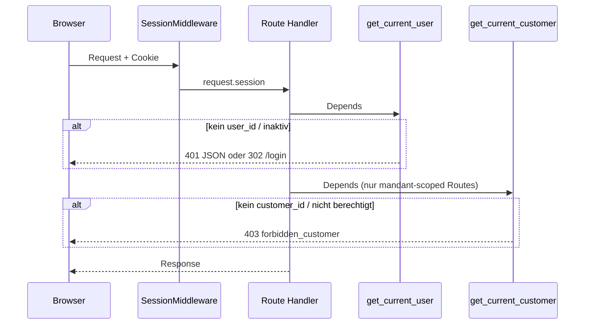

# 02 — Request- und Session-Flow

**Stand:** 2026-06-03

---

## Session-Inhalt

Nach Login enthält die signierte Session (`SessionMiddleware`, Cookie `session`):

| Key | Bedeutung |
|---|---|
| `user_id` | UUID des `users`-Datensatzes |
| `customer_id` | Slug des **aktiven** Mandanten (optional bis zur Wahl) |

Konfiguration: `backend/app/main.py` — `SESSION_SECRET`, `SESSION_COOKIE_SECURE`, `same_site=lax`.

---

## Ablauf geschützter Requests

---

## Login (`POST /login`)

1. `get_user_by_email` + `verify_password` (Argon2)
2. `request.session.clear()` → `user_id` setzen
3. Wenn Nutzer **genau einen** Mandanten hat → `customer_id` vorbelegen
4. Redirect `/chat`

Spiegel: `auth.md`, `routes.md` (login)

---

## Logout (`POST /logout`)

Session leeren → Redirect `/login`.

---

## Mandantenwechsel (`POST /api/session/customer`)

1. Body: `{ "customer_id": "bglu" }`
2. `user_has_customer(db, user.id, customer_id)` — inkl. Global-Sonderlogik
3. Erfolg: `session["customer_id"]` setzen
4. Client (`app.js`): Seite neu laden — KB + Chat neu scoped

Spiegel: `customers.md` (`user_has_customer`), `tenant.md`

---

## Route-Kategorien

| Kategorie | Depends | Beispiele |
|---|---|---|
| Öffentlich | — | `/login`, `/api/health` |
| Authentifiziert | `get_current_user` | `/api/customers`, Admin-HTML (teilweise) |
| Mandant-scoped | `+ get_current_customer` | `/api/documents`, `/api/chat`, `/kb` |
| Admin | `get_admin_user` | `/api/admin/*`, `/admin/*` |

Admin-HTML: `_admin_page_redirect` leitet Nicht-Admins nach `/chat`.

---

## Exception-Handler (JSON)

Zentral in `main.py`: `NotAuthenticatedError` → 401/302, `ForbiddenCustomerError` → 403, `CustomerAdminError` / `UserAdminError` → strukturierter Body mit `error`-Code.

---

## Betroffene Spiegel-Dateien

`main.md`, `auth.md`, `tenant.md`, `routes.md`, `customers.md`, `static/app.md` (Kunden-Dropdown)
